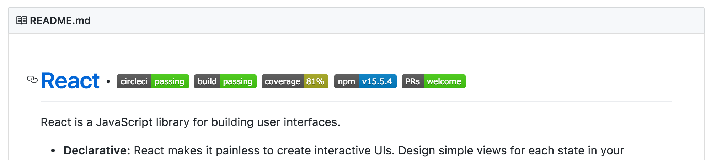
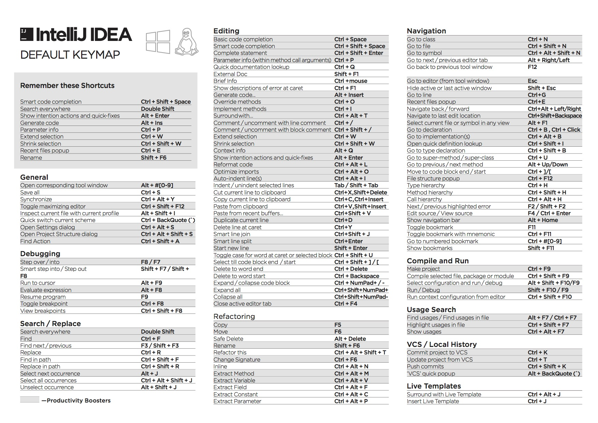
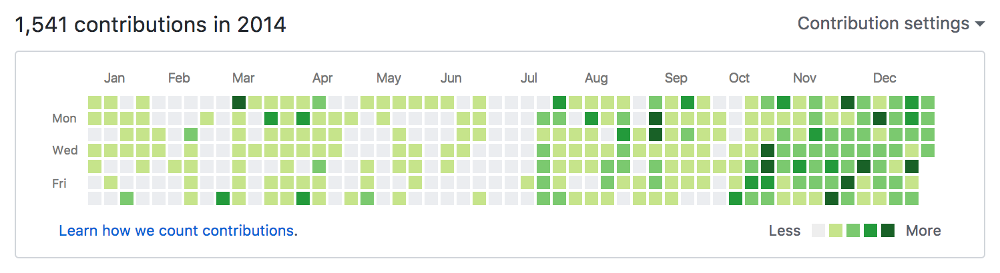

在工作的前三年里快速成长『练习篇』
---

成长不会像财富，可以中彩票，然后一夜间暴富；也可以发个自拍，然后一夜成名。可技术成长，我们只能一步一个脚印去练习，借此掌握某项特定技术。等熟练的时候，我们才能用更短的时间，来掌握某项特定的技术。

可练习，也不是一天里写一万行代码，也不是重复写一百行代码；而是在一百天里，每天写下一百行代码。它需要一定的技巧，不懈的坚持，还有一些休息。因此在这篇文章里，我将分享我之前的一些练习经验：

 - 如何使用正确的练习姿势。从程序员的基本技能：盲打，到练习使用快捷键、重构技能等，再到如何使用新的框架练习。
 - 如何通过练习来提高自己。初学时，我们可以使用 Vue、React去高仿一些项目；有经验时，这样的高仿只会让我们更累。这时候，我们就需要一些更高级的练习技巧，从引入别的框架思想，到造各式各样的轮子。
 - 找到合适的时间练习。早上，慢慢进入状态；中午，适合做一些 Review；碎片时候，可以做一些知识的管理等等。
 - 怎样才能持之以恒下去。我只是想来继续吹牛逼一下，之前是如何在 GitHub 上连击近两年。

当然了，能花时间练习的一个大前提是：**我们有充足的时间**。因为我们知道，技术能力不足导致的加班，是一种恶性循环。

如果你还没工作，那么便相当的幸运，有相当多的时间。工作的时候，大家都忙于实现业务功能，没有时间让你提升自己。如果你已经工作了，那么你需要每天预留一些日子，你才能有时间去练习。每天会占用一些你的游戏时间、看电视时间，哪怕只是半个小时，一周、一个月下来总会很有帮助的。

进行这些练习之前，请不要忘了根本——**能熟练地用框架、语言完成工作**。完成工作，相当于是一个 60 分的及格要求。在胜任工作之上，去提高能力到达到 80 分、90 分，追求更好的技术能力，才是正确的路线。

下面，让我们开始第一部分的内容吧~。

## 如何使用正确的练习姿势

小学时，自参加了五笔打字比赛，便开启了我的编程生涯。可当我工作的时候，我可以熟练的完成工作，但是仍然无法打对每一个字符。有一天，看到了一个名为 Typing（[https://typing.io/](https://typing.io/)） 的在线工具，便试着进行了一些编码练习。尽管编程的时候，我们只是在码字，编码的过程实际 上是在脑子里完成的。但是得到的反馈能表明，在打字这方面，仍然有一些提升的空间：

我的“自我解释”是：**今天的编程语言设计得不合理**——使用了各种字符，导致了右手在这方面的负担比较大。在那之后，我便陆续进行了一些基础的练习，并整理他们的因果关系，便有了下面的一些练习项目：

 - 作为经常用电脑的人，我们应该掌握好打字的基本技巧，比如说采用正确的打字姿势，以及盲打技能。
 - 作为一个程序员，我们已经“精通”使用手上各式的IDE、编辑器，熟练使用它们的快捷键。
 - 作为一个专业的程序员，我们还需要将重构代码、命名等高级的技巧掌握好。

这些练习，可以让我们变成一个更专业的程序员。

### 语言与框架的练习

对于语言与框架的练习，算是比较简单。于我而言，这个过程便是：

 1. 买本相关的书籍，或者教程、官方的指南。
 2. 再找个合适的 Demo 作为基础。
 3. 在 Demo 的基础上，依据一些业务功能扩展。
 4. 查看官方文档，看看自己是不是漏掉了什么重要的东西。
 5. 编写博客来记录这个过程。

因而，我们只需要找一个合适的网站、APP，作为模仿的对象，一步步往下练习即可。唯一的难点在于，我们第一次写 Web 应用的时候，可能会多花费一些时间。这时，我们对很多的概念都不清楚，如若能找到一个新手社区，那么要练习起来就会更方便了。

熟练使用语言或者框架，不能帮助我们成为一个优秀的成员。它只能带我们成为一个『胜任』的程序员，即我们可以凭借着这种练习，轻松地找到工作。

### 工程实践练习：模仿开源软件

工作的时候，我们写的都是业务代码，在纯技术上的实践并不多。这意味着，**多年的工作经验，与技术能力的关系并不大**。如果有一天，我们看到几年前写的代码，和今天写的代码并没有太大的区别，那么说明了：我们已然陷入了一个瓶颈。

在学校写的代码，与工作写的代码，最大的区别在于：软件工程实践。单单只是凭借工作经验的话，那么在软件工程实践上的提高并不会太大。受限于上线 deadline 的影响，项目的软件工程实践并不能做到最好，甚至可能很差劲。如我们所见，国内的大部分公司（包括BAT）在这方面的花费特别少。这些实践包括：

 - 使用版本管理。诸如 GitHub 上的项目采用的 Git，今天这个实践基本已经普及了。
 - 使用持续集成。它可以为团队协作，提供一个可靠的帮助。
 - 完整的测试用例。编写单元测试、功能测试等等
 - 代码检视。用于提高整个项目的质量
 - 等等

而对于一个优秀的开源软件来说，为了保证好项目的质量。拥有者往往付出了很多的精力，在提高软件工程的实践上。因此，对于软件工程实践来说，最好的练习，便是模仿开源软件，并自己去创造一些轮子。

以 React 为例，其在首页拥有下面的几个徽章（badge）：

分别是：

 1. Circle CI，即持续集成，诸如测试是否都通过、部署是否成功等等。
 2. Travis CI，即持续集成的状态，诸如测试是否都通过、部署是否成功等等。
 3. Coverage，代码的测试覆率，81%。
 4. npm，当前的版本号。
 5. PRs welcome，即欢迎来 Pull Request。

那么，我们在实践的时候，就可以模拟这样的项目组成，一步步往下实践：

 1. 为项目添加测试框架，如 Java 里的 JUnit，Node.js 里的 Mocha 等等。
 2. 添加自动化测试脚本，如 Java 里的 Gradle，Node.js 里的 Grunt、Gulp、NPM 等等
 3. 添加测试覆盖率工具。
 4. 添加持续集成，如 Travi CI 或者 Circle CI。
 5. 添加代码质量分析工具，如 Code Climate
 6. 制定目标，并完成。

最难的实际上是最后一步，制定一个目标并实现。它可以是测试覆盖率要达到 90% 以上，这就需要一步步的来完成，如先将目标放到 60%，再慢慢地往上提升，直到 90%，甚至 100%。在这个过程中，会不断地遇到一些挑战，如**难以测试的代码**，**为了编写测试而修改功能代码**等等。但是，它能确确实实地帮助我们提高工程能力。

### 基础练习：从码字到盲打

五笔这种输入法，在今天已经逐渐地要被市场淘汰。可是，它与我们手上所使用的拼音输入法相比，有一个很大的优点是：输入固定的字符，得到固定的结果。我们使用拼音输入法输入字符“lan”时，屏幕上会出现不同的几个结果，供我们选择；而不我们使用五笔时，我们输入“ajtl”，就可以得到一个固定的“蓝”字。

而我们编码的时候，如果我们心里想输入的是一个``print``，结果打下的字符是 ``oront``，那么我们就需要删了重来。又或者是小心翼翼地，边看键盘边输入一个个字符。

虽说，编码只是一个打字的过程，但是很多时候，经常出现的错字会中断我们的思路。因此，**盲打应该做程序员的基本技能**。而这里的盲打，指的并不是我们可以闭上眼晴可以打字聊天，而可以完成编程工作，即能盲打下 26 个字母，及各种字符，还有各种功能键。

而在进行这一类练习的时候，**我们经常会遇到的一个障碍：度量**。即以某种方式来衡量练习的成果，我们做了很多的练习来提高自己，但是没有数据来支撑。它不像编码，我们写了几行代码，完成了一个功能，那么写下的这些代码的价值就是可以衡量的。

因此，练习的时候，我们可以寻找一些合适的工具，如 Typing.io、Keybr.com 这一类工具。如 Typing 使用的是真实的代码片段，它能帮我们发现真实场景下：我们容易打错哪些字，容易按错哪些键，我们的打字速度是多少等等的内容。

对于可以衡量的打字练习，我们可以订下**每天十几分钟的时间**，一段时间要提升到什么水平的目标。这样它便能满足**SMART原则**，就能让我们看到我们在这段时间内的提升。

当时，我拿 Typing 练习的时候，差不多练习了一个月，每天大概半小时左右。因为打字的速度比较快，所以容易出错，所以便将注意力放在减少错误上。而对于有些人来说，则是相反的，即打字速度比较慢，但是准确率比较高。而这个练习的主要目的是，能熟练地做到**盲打**，不让它影响我们的效率。

掌握了熟练开关机、键盘上的各种按键后，我们就在使用工具上做一些效率的提升。

### 基础练习：掌握开发工具

刚工作的时候，发现每个有经验的程序员，几乎可以不用鼠标编程。他们可以熟练的使用各种快捷键，进行代码重构、打开新页面、开启新窗口等等的操作。慢慢的，我觉得自己在这方面上有相当大的提升空间。

这意味着，我要学习、探索开发工具的功能，也要能使用快捷键来控制。尽管在日常结对编程、代码检视、交流的时候，可以请从别人身上学习。但是理想的方式，还是应该自己去练习。

对于大部分的开发工具，它们都有对应的 手册、Keymap 或者 cheatsheet，即“作弊表”。如下是 Intellij Idea Keymap 的截图：

上面列出了其可用的快捷键，及其相应的用途。因而只需要打印好，放在眼睛能看到的地方，就能有效的改善。除了打印成纸质资料，他们还可以有不同的形式，如鼠标垫、杯子的形式。需要的时候，便可以看到；平常看到的时候，也能多多少少记住一些。

需要注意的，对于开发工具而言，我们没有必要掌握所有的快捷键，而是只掌握**常用的功能**。我曾陷入了一个误区，练习使用快捷键的时候，边练习一些重构的技巧，同时也花费了时间在在练习一些『屠龙之术』上——一些非常少用的功能，除了炫耀，也没有什么用。时间一久，我便忘了很多的快捷键。

再举些例子：如 Vim，对于我而言，一般用于服务器维护及 Git 修改。因此，主要使用的功能便是：快速地改几个字符、更新配置，保存并退出。如 Chrome 浏览器，在日常使用时，配合下 Vim 插件，便不需要鼠标。在进行前端开发的时候，便需要使用鼠标来调试。

对于大部分的工具来说，我们只需要一个 CheatSheet。复杂的工具，如 Vim、Emacs，则需要有一本更专业的书。它们是高度可定制的，这也意味着我们需要一步步的定制这些工具，寻找合适的插件，自定义快捷键，又或者是使用别人的配置。

而，要衡量这方面的提升，目前还没有看到有效的工具。如果有的话，那么就是编码的时候，使用鼠标的频率。因此，在某些特定的时候，可以通过禁用鼠标来提升自己在这方面的能力。

## 如何通过练习来提高自己

尽管我在上面指出，学习新框架的最好姿势是：基于现有的业务来学习。即从工作中学习，从做中学。但是，如果一直**只使用**新的框架来重写旧的业务，那么你的成长就会趋近于 0。第一次，使用新框架时收获可能颇丰；第二次，收获的东西就更少了；第三次，你可能就学不到东西。

因此，在业余的练习时间里，不要一直练习新的框架，不要再拿 Vue、React Native 去高仿一些应用。**当且仅当，你所处的项目正在使用新的框架**，这种练习才是有意义的。

经过上面的练习，我们提高了我们的工作效率。同时，在别人的眼里，我们更像是一个专业的程序员。在这之上，我们还需要提高顶层的能力。下面介绍的是，我尝试过的一些，比较有效果的提升方法：

 - 结合设计模式
 - 引入其它框架的思想
 - 创建自己的轮子来重写应用

总的来说，收获还是蛮多的，特别是造轮子，能有更大的提升。与其他的练习稍有不同的是，因为涉及到代码设计，这里的练习有些难以衡量。这时候，我们应该是保持着**练习的心态**，并意识到我们是在做这方面的练习。

### 结合设计模式

设计模式，不同的人有不同的看法。在我看来，一个优秀的程序是要能『看懂』的。即不一定要精通，但是能识别出来，它是一种设计模式。当你看到了一次又一次的相似设计时，你应该猜想到，它背后应该是一种设计模式。如在前端开发框架中的『双向绑定』，它实际上就是发布-订阅模式，又或者称观察者模式的一种实现。

在我看来，模式就是一种高级的 DSL。当你一说『工厂模式』，别人瞬间就明白了，不犹得会发出：原来如此，这一类的感叹。当我们习惯了一些模式的时候，一遇到一些特定的场景，我们就能一下子套用这种模式。

### 引入其它框架的思想

Redux，框架最初是用在 React 上，但是它已经被推广到了 React 和 Vue.js 上。

好的框架、软件是会相互学习，如 iPhone 与 Android，都在不断地借鉴——通知中心，但是又在那之上做一些改进。

### 创建自己的轮子来重写应用

如在前端领域，大部分的框架本身都是『通用』的。因此，有相当多的功能，你可能并不需要用到。如你使用 jQuery 的时候，你可能只会使用到其中的 Ajax、Event等功能， 那么你就可以写一个新的框架，兼容这两个接口。

### SMART 原则

对于业务代码而言，你不一定需要很多的代码。

 - 具体的（Specific）
 - 可以衡量的（Measurable）
 - 可以达到的（Attainable）
 - 其他目标具有相关性（Relevant）
 - 明确的截止期限（Time-based）

## 找到合适的时间练习 

即使是在同一个公司，不同的人都有不同的上下班时间，所花费在路上的时间也有所不同。有的人，需要在几环外坐个一个多小时的地铁，再转公交才能到公司；有的人，只需要出门左转，走个十分钟就到公司了。因为在路上花费的时间不同，也在一定程度上影响了学习、练习等等的时间。

因此，如果可能的话，应该减少花费在上班路上的时间，才能避免继续陷入这样一个恶性循环：租不起近的房子，花费大量的时间在路上，没有时间提升技能。

**早上**

笔者已经习惯了，每天七点起床、洗漱，随后写会代码，再去上班。有时候，可以有一个半小时的练习时间，有时候会有半个小时，将这些时间浪费在梦里总是有些可惜。同时，之前为了能成功地上公交，便提前半个小时到公司，写一些开源软件的代码。毕竟，作为一家非产品公司，你无法和别人解释说，我们做了些什么、取得了哪些成就。

早上的练习，是一种慢慢进入一天工作状态的感觉。一旦上班时间到来的时候，就已经进入工作姿态了——对于“资本家”来说，可谓好事一件。早晨刚醒来，总会想不起昨天项目做到哪一步，便更容易反思哪里做得有问题。

**中午**

吃完饭后，因为米饭的缘故，容易犯困。这个时候，虽然不妨碍我们进行一些练习，但是也应该做一些休息。

**碎片时间**

对着屏幕写代码，时间一久，集中力就会开始涣散，便应该休息会儿。刷刷资讯、朋友圈，又或者是，收集各种资料，开放我们的视野。我们需要各种新的知识，来扩大自己的视野，以便于自己了解整个市场的水平。

如 GitHub Trending

存储到 Evernote、Wunderlist、OneNote 等各式各样的云笔记里。

**晚上**

应该在睡觉前 30~60 分钟停止编码，否则上床的时候，脑子里可能还是这些代码，就容易失眠。万一灵感一来，那就还要爬起来继续写。这个时候，可以阅读一些相关或者无关的书籍、资料，在这个过程中，很容易地就会遇到一些灵感。

最后，休息的时候，尽情睡觉吧~。

## 怎样才能持之以恒下去

上面的三部分内容里，我们只谈论一些方法和技巧，可是它们并没有什么用。每个人都知道所谓的『一万小时理论』，但是真正要坚持下来，并没有我们想象中的那么容易。

我们需要从娱乐时间里抽到一部分，原本舒适的玩游戏、睡觉、刷微博时间，现在要成为另外一种『痛苦』？

可是，既然这些“无聊的事情”我们都能上瘾，那么我们是不是没有找到合适的路？

### 寻找成就感

我们可以使用 GitHub 上的 Contributions 来激励自己，每一天的痕迹都很明显，甚至于可以拉拢一些小伙伴，与我们一起参加类似的活动。

开始的时候，7 天里，基本上很充实

21 天，偶尔会更新一下 README，

xxx，后来挖的坑越来越多，已经填不完了、

### 如何去做

 一点点改变
 
  - 创建一个项目
  - 更新 README
  - 做什么 -> Ideabook
  - GTD
  
### 做一个总结 

事实上，练习之后的最好的成长方式，就是输出，总结。将知识整理成图谱，以便于成长。

End，欢迎分享。
