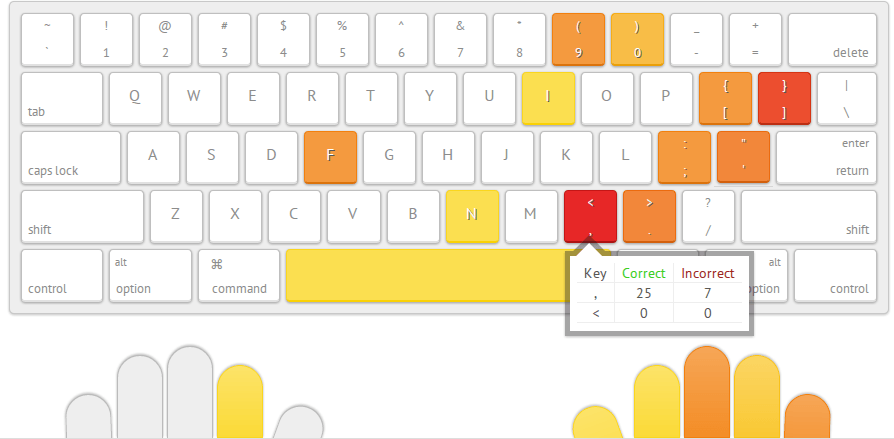

在工作的前三年里快速成长『练习篇』
---

成长不会像财富，可以中彩票，然后一夜间暴富；也可以发个自拍，然后一夜成名。可技术成长，你只能一步一个脚印去练习，借此掌握某项特定技术。等熟练的时候，我们才能用更短的时间，来掌握某项特定的技术。

可练习，也不是一天里写一万行代码，也不是重复写一百行代码；而是在一百天里，每天写下一百行代码。它需要一定的技巧，不懈的坚持，还有一些休息。因此在这篇文章里，我将分享我之前的一些练习经验：

 - 如何使用正确的练习姿势。从程序员的基本技能：盲打，到练习使用快捷键、重构技能等，再到如何使用新的框架练习。
 - 练习适宜难度的项目来提高自己。初学时，我们可以使用 Vue、React去高仿一些项目；有经验时，这样的高仿只会让你更累。这时候，我们就需要一些更高级的练习技巧，从引入别的框架思想，到造各式各样的轮子。
 - 找到合适的时间练习。早上，慢慢进入状态；中午，适合做一些 Review；碎片时候，可以做一些知识的管理等等。
 - 怎样才能持之以恒下去。我只是想来继续吹牛逼一下，之前是如何在 GitHub 上连击近两年。

当然了，能花时间练习的一个大前提是：**你有充足的时间**。因为我们知道，技术能力不足导致的加班，是一种恶性循环。

如果你还没工作，那么你相当的幸运，你有相当多的时间。工作的时候，大家都忙于实现业务功能，没有时间让你提升自己。如果你已经工作了，那么你需要每天预留一些日子，你才能有时间去练习。每天会占用一些你的游戏时间、看电视时间，哪怕只是半个小时，一周、一个月下来总会很有帮助的。

下面，让我们开始第一部分的内容吧~。

## 如何使用正确的练习姿势

小学时，自参加了五笔打字比赛，便开启了我的编程生涯。可当我工作的时候，我可以熟练的完成工作，但是仍然无法打对每一个字符。有一天，看到了一个名为 Typing（[https://typing.io/](https://typing.io/)） 的在线工具，便试着进行了一些编码练习。尽管编程的时候，我们只是在码字，编码的过程实际 上是在脑子里完成的。但是得到的反馈表明，在这方面，仍然有一些提升的空间：

在那之后，我便陆续进行了一些基础的练习。整理他们的因果关系，便有了下面的一些练习项目：

作为经常用电脑的人，我们应该掌握好打字的基本技巧，比如说采用正确的打字姿势，以及盲打技能。

作为一个程序员，我们已经“精通”使用手上各式的IDE、编辑器，熟练使用它们的快捷键。

作为一个专业的程序员，我们还需要将重构代码、命名等高级的技巧掌握好。

在进行这些练习之前，请不要忘了根本——能熟练地用框架和语言完成工作。

### 基础练习：盲打

五笔这种输入法，在今天已经逐渐地要被市场淘汰。可是，它与你手上所使用的拼音输入法相比，有一个很大的优点是：输入固定的字符，得到固定的结果。我们使用拼音输入法输入字符“lan”时，屏幕上会出现不同的几个结果，供你选择；而不我们使用五笔时，我们输入“ajtl”，就可以得到一个固定的“蓝”字。

而当我们编码的时候，如果我们心里想输入的是一个``print``，结果打下的字符是 ``oront``，那么我们就需要删了重来。又或者是小心翼翼地，边看键盘边输入一个个字符。

虽说，编码只是一个打字的过程，但是很多时候，经常出现的错字会中断我们的思路。

Typings.io

练习的时候，我们经常会遇到的一个障碍：度量。即以某种方式来衡量练习的成果，我们做了很多的练习来提高自己，但是没有数据来支撑。

我们写了几行代码，完成了一个功能，那么写下的这些代码的价值就是可以衡量的。

因此，当我们制定一个目标时，可以尝试使用：SMART 目标原则。

### 基础练习：掌握开发工具

在掌握了熟练开关机，以及各种按键后，我们就需要开始，在软件使用上做一些提升。
 
 - IDE 快捷键 -> 掌握好你的工具是相当重要的~、

SHIFT+F6 重命名、Command+E 切换最近文件、SHIFT+Alt+Command 重构

对于复杂的工具，如 Vim、Emacs，你需要有一本更专业的书。

Vim，对于我说，一般是用于服务器维护，如：快速地改几个字符、更新配置，保存并退出。

### 进阶：练习框架与语言

语言，

框架，主要是

熟练使用他们，不能帮助你成为一个优秀的成员，但是可以带你成为一个『胜任』的程序员。即，你可以凭借着这种练习，轻松地找到工作。

### 高级练习

 - 重构技巧（Java、JavaScript）
 - 设计模式与架构
 - 算法？

对于业务代码而言，你不一定需要很多的代码。

## 练习适宜难度的项目来提高自己

尽管我在相关的文章中指出，学习新框架的最好姿势是：基于现有的业务来学习。即从工作中学习，从做中学。

但是，如果一直**只使用**新的框架来重写旧的业务，那么你的成长就会趋近于 0。第一次，使用新框架时收获可能颇丰；第二次，收获的东西就更少了；第三次，你可能就学不到东西。

因此，在业余的练习时间里，不要一直去练习新的框架，不要再拿 Vue、React Native 去高仿一些应用。

当且仅当，你所处的项目正在使用新的框架，这种练习才是有意义的。

### 结合设计模式

设计模式，不同的人有不同的看法。在我看来，一个优秀的程序是要能『看懂』的。即不一定要精通，但是能识别出来，它是一种设计模式。当你看到了一次又一次的相似设计时，你应该猜想到，它背后应该是一种设计模式。如在前端开发框架中的『双向绑定』，它实际上就是发布-订阅模式，又或者称观察者模式的一种实现。

在我看来，模式就是一种高级的 DSL。当你一说『工厂模式』，别人瞬间就明白了，不犹得会发出：原来如此，这一类的感叹。当我们习惯了一些模式的时候，一遇到一些特定的场景，我们就能一下子套用这种模式。

### 引入其他框架的思想

Redux，框架最初是用在 React 上，但是它已经被推广到了 React 和 Vue.js 上。

好的框架、软件是会相互学习，如 iPhone 与 Android，都在不断地借鉴——通知中心，但是又在那之上做一些改进。

### 创建自己的轮子来重写

如在前端领域，大部分的框架本身都是『通用』的。因此，有相当多的功能，你可能并不需要用到。如你使用 jQuery 的时候，你可能只会使用到其中的 Ajax、Event等功能， 那么你就可以写一个新的框架，兼容这两个接口。

## 找到合适的时间练习 

### 早上？

慢慢进入状态

以前，为了能成功地上公交，提前半个小时到公司。我就会写一些开源软件的代码，作为一家非产品公司，你无法和别人解释说，你做了些什么、

### 中午？

吃完饭

### 碎片

收集各种资料，开放你的视野。

如 GitHub Trending

你需要各种新的知识，来扩大自己的视野，以便于自己了解整个市场的范围。

### 晚上？丰富

最后，休息的时候，尽情睡觉吧~。

## 怎样才能持之以恒下去

上面的三部分内容里，我们只谈论一些方法和技巧，可是它们并没有什么用。每个人都知道所谓的『一万小时理论』，但是真正要坚持下来，并没有你想象中的那么容易。

我们需要从娱乐时间里抽到一部分，原本舒适的玩游戏、睡觉、刷微博时间，现在要成为另外一种『痛苦』？

可是，既然这些“无聊的事情”我们都能上瘾，那么我们是不是没有找到合适的路？

## 寻找成就感

365 天， 事实上是，365* 2- 7 天。

开始的时候，7 天里，基本上很充实

21 天，偶尔会更新一下 README，

xxx，后来挖的坑越来越多，已经填不完了、

### 如何去做

 一点点改变
 
  - 创建一个项目
  - 更新 README
  - 做什么 -> Ideabook
  - GTD
  
### 做一个总结 

事实上，练习之后的最好的成长方式，就是输出，总结。将知识整理成图谱，以便于成长。

End，欢迎分享。
  
